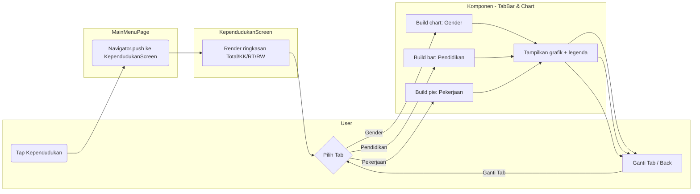
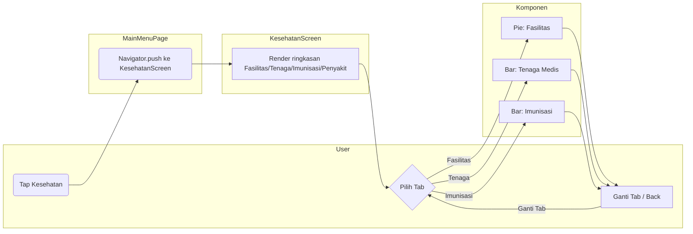
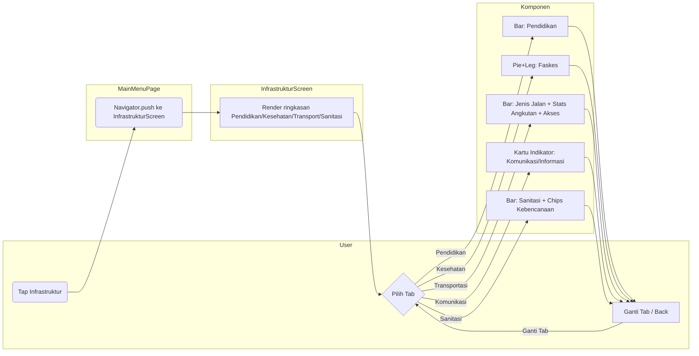
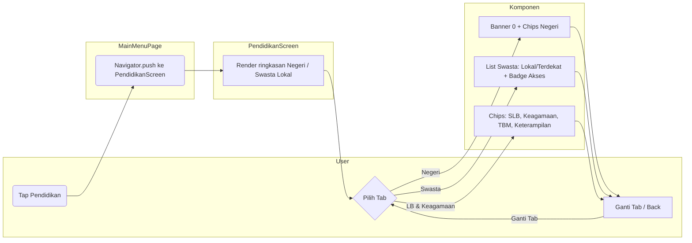
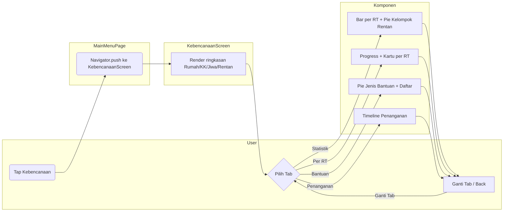
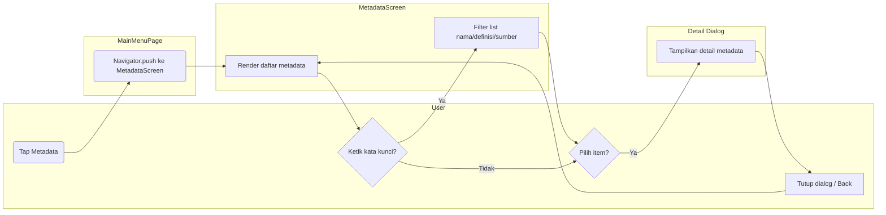

# Activity Diagram per Fitur (Swimlane)

Berikut aktivitas utama untuk setiap modul/fitur menggunakan swimlane (subgraph sebagai lane). Orientasi kiri→kanan agar lane tersusun horizontal.

## Kependudukan

## Kesehatan

## Infrastruktur

## Pendidikan

## Kebencanaan

## Metadata

Catatan umum
- Semua modul saat ini menggunakan data dummy/konstanta; tidak ada I/O jaringan.
- Akses tamu (Guest) bersifat read-only—tidak ada aksi pembuatan data.
