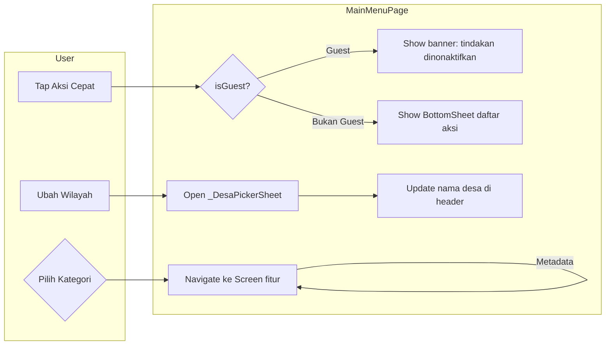

# Activity Diagram (Swimlane)

Berikut dua alur aktivitas utama yang ditulis dengan swimlane (subgraph sebagai lane).

## 1) Alur Login (Email/Password)

```mermaid
flowchart LR
  %% Lanes
  subgraph U[User]
    U1[Masukkan email & password]
    U2{Coba lagi?}
  end

  subgraph L[LoginScreen]
    L1{Validasi lokal}
    L2[Show error]
    L3[Call AuthService.signIn]
  end

  subgraph A[AuthService]
    A1[auth.signInWithPassword]
    A2{Sukses?}
    A3[Map error → pesan ramah]
    A4[from('users').select(role)]
    A5[Set _user/_userRole + notifyListeners]
  end

  subgraph S[Supabase]
    S1[Auth]
    S2[Query role]
  end

  subgraph R[RootPage/MainMenu]
    R1[onAuthStateChange → rebuild]
    R2[Render MainMenuPage]
  end

  %% Flow
  U1 --> L1
  L1 -->|Invalid| L2 --> U2
  L1 -->|Valid| L3 --> A1 --> S1 --> A2
  A2 -->|Tidak| A3 --> L2 --> U2
  A2 -->|Ya| A4 --> S2 --> A5 --> R1 --> R2
  U2 -->|Ya| U1
```

Detail
- Validasi lokal: email tidak kosong, password ≥ 6 karakter.
- Error jaringan/credential dipetakan via `mapAuthError()` agar pesan lebih jelas.
- Setelah sukses, peran dibaca dari `users.role` → menentukan akses Aksi Cepat.

## 2) Navigasi Fitur & Pembatasan Guest



Catatan
- Semua modul data saat ini bersifat read-only dengan data dummy di dalam app.
- Mode Guest: UI menonaktifkan FloatingActionButton Aksi Cepat dan menampilkan peringatan jika dibuka.
