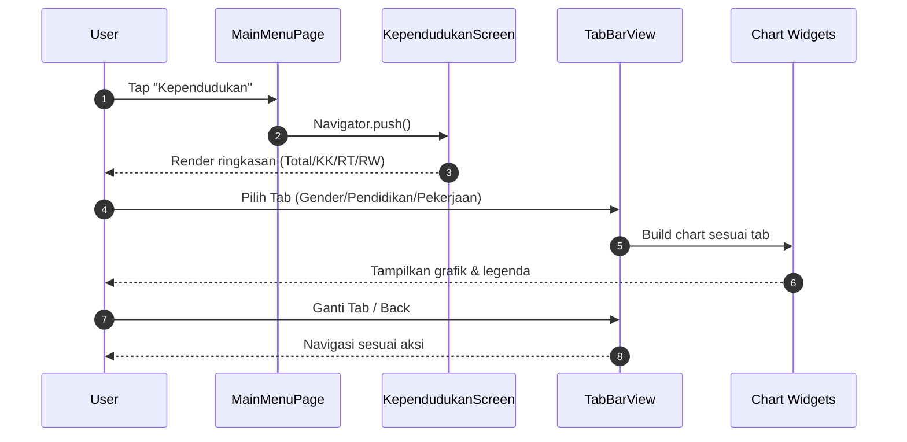
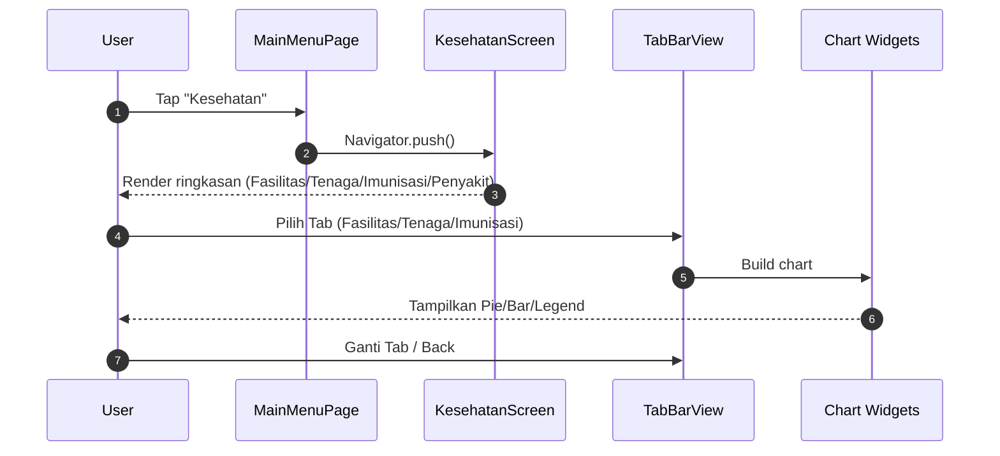
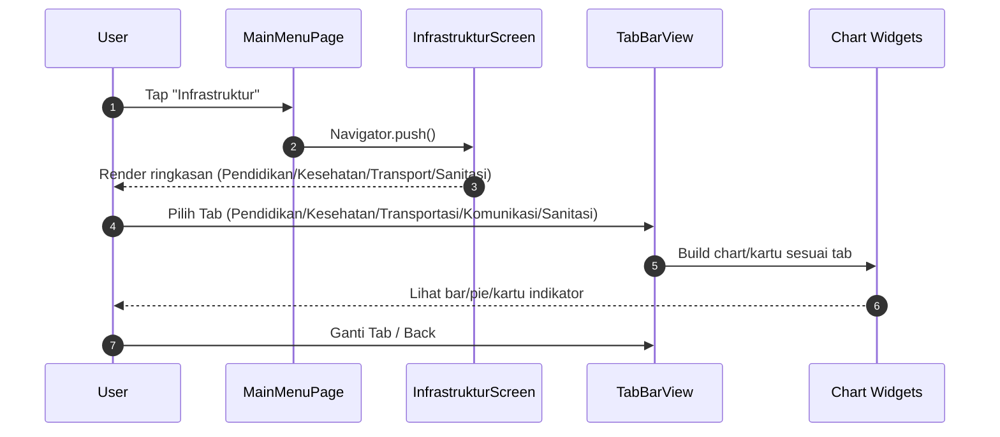
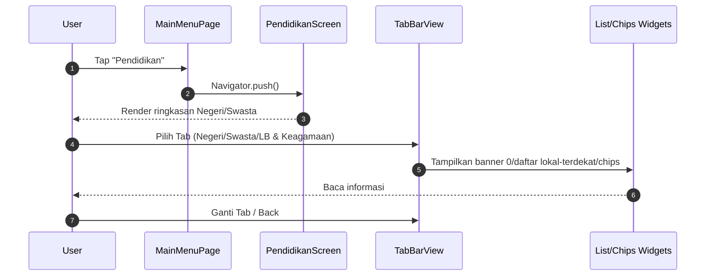
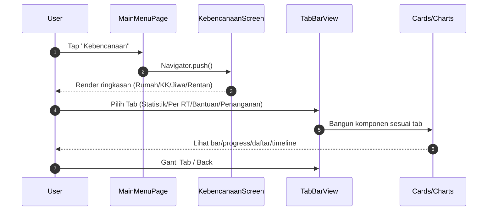
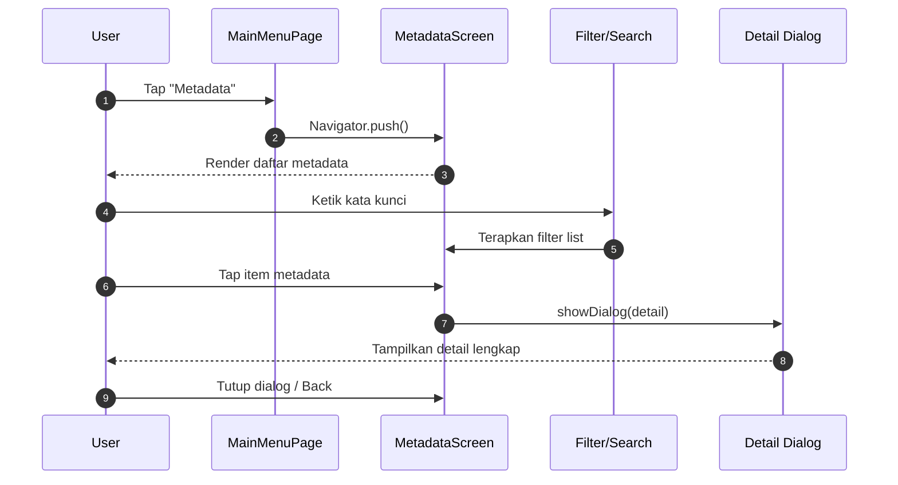

# Sequence Diagram per Fitur

Diagram urutan interaksi antar komponen untuk setiap modul.

Catatan umum
- Saat ini data berada di dalam state lokal/widget; tidak ada panggilan ke backend selain autentikasi.
- Lifeline utama: User → MainMenuPage → <Feature>Screen → (Widget Komponen/Chart) → (opsional) Dialog.

## Kependudukan

## Kesehatan

## Infrastruktur

## Pendidikan

## Kebencanaan

## Metadata

