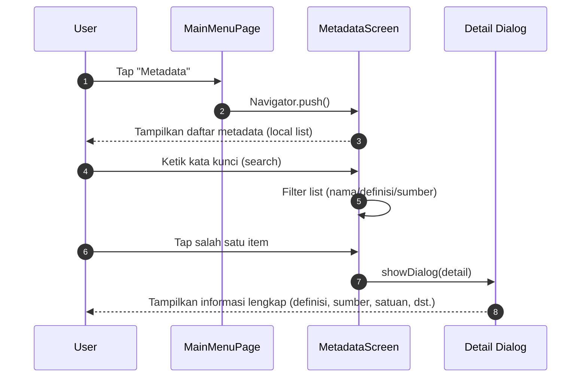

# Sequence Diagram

Dua skenario interaksi komponen utama.

## 1) Login Berhasil (Email/Password)

```mermaid
sequenceDiagram
  autonumber
  participant U as User
  participant L as LoginScreen
  participant A as AuthService
  participant S as Supabase (Auth + DB)
  participant R as RootPage
  participant M as MainMenuPage

  U->>L: Isi email & password, tekan Sign In
  L->>A: signIn(email, password)
  A->>S: auth.signInWithPassword()
  S-->>A: session + user
  A->>S: from("users").select('role').eq('id', uid)
  S-->>A: { role: 'admin' | 'user' }
  A->>A: set _user, _userRole; notifyListeners()
  S-->>A: onAuthStateChange(event: SignedIn)
  A-->>R: notify (Consumer<AuthService>)
  R->>M: Build MainMenuPage(isAdmin)
  M-->>U: Tampilkan menu kategori + (opsional) Aksi Cepat
```

Catatan
- Jika query role tidak menemukan user, role default di-set ke `user`.
- Kesalahan jaringan/credential dibungkus pesan ramah ke UI.

## 2) Melihat Detail Metadata



Catatan
- Data metadata diambil dari list lokal (`_metadataList`). Integrasi backend bisa ditambahkan di masa depan untuk sinkronisasi.
